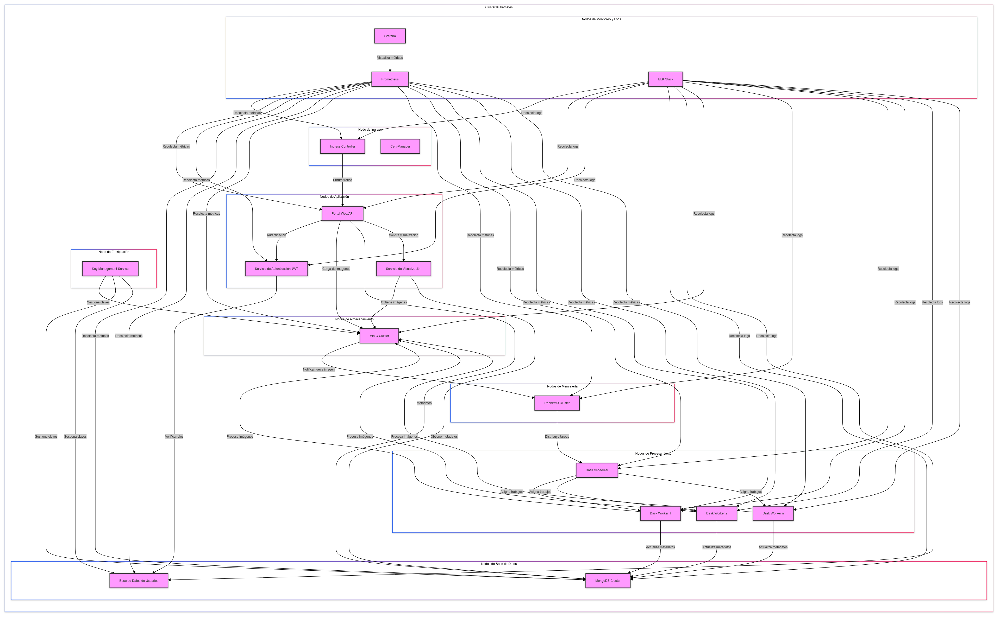

# Test Python imeXHS

Este repositorio tiene como funcionalidad establecer los codigos para la prueba tecnica de imexHS

## Recomendaciones

Es recomendable crear un entorno virtual e inicializarlo antes de ejecutar el archivo, para instalar dependencias independientes del sistema operativo. Si estás en Linux, puedes crear el entorno virtual en el repositorio imeXHS:

```bash
 python3 -m venv venv
 source venv/bin/activate
```

Una vez instalado y activado el entorno virtual, puedes iniciar los scripts.

## punto 1 - script

El script `punto1.py` es una herramienta en Python que permite realizar operaciones básicas sobre archivos y directorios. Ofrece funcionalidades para:

1. Listar el contenido de una carpeta.
2. Leer un archivo CSV y mostrar información sobre columnas y datos numéricos.
3. Leer un archivo DICOM y mostrar información de metadatos.

Este script utiliza las bibliotecas `pandas`, `pydicom`, y `logging` para realizar estas tareas.

### Requisitos

Para ejecutar este script, asegúrate de tener instaladas las siguientes bibliotecas:

- `pandas`
- `pydicom`

Puedes instalar estas bibliotecas utilizando `pip`:

### Uso

para correr el script necesitas el sigueinte comando una vez las librerias esten instaladas

```sh
python punto1.py <number[1-3]> <path> <filename> [<tag> ...]
```

### Ejemplo

si el archivo se encuentra en la misma ruta. (de lo contrario ingrese la ruta)

```sh
python punto1.py 3 ./ sample-01-dicom.dcm 0x0008 0x0016
```

## punto 2 - script

El script `punto2.py` permite cargar y procesar información de estudios DICOM utilizando Pydantic para modelado y validación de datos. El script lee la información del paciente y del estudio desde un archivo DICOM y la imprime de manera formateada.

### Características

- **PatientRecord**: Modelo para almacenar información del paciente.
- **Diagnosis**: Hereda de `PatientRecord` e incluye funcionalidades para actualizar y registrar diagnósticos.
- **StudyRecord**: Hereda de `PatientRecord` e incluye campos específicos para registros de estudios.
- **DICOMStudyLoader**: Hereda de `StudyRecord` y proporciona funcionalidad para cargar datos desde un archivo DICOM.

### Uso

1. **Configuración**: Asegúrate de tener `pydicom` y `pydantic` instalados. Puedes instalarlos usando pip:

   ```bash
   pip install pydicom pydantic
   ```

2. **Ejecutar el Script**: Proporciona la ruta a un archivo DICOM como argumento de línea de comandos al ejecutar el script.

   ```bash
   python punto2.py ruta/al/archivo_dicom.dcm
   ```

3. **Salida**: El script cargará el archivo DICOM, extraerá la información relevante y la imprimirá en la consola. La salida incluye la información del paciente y los detalles del estudio.

## punto 3

### punto 3a script

Este script en Python utiliza hilos para imprimir números pares e impares entre 1 y 200. Utiliza la biblioteca `threading` para manejar la concurrencia y sincronización de los hilos.

#### Características

- **print_even_numbers**: Función que imprime números pares del 1 al 200, esperando 0.5 segundos entre cada impresión.
- **print_odd_numbers**: Función que imprime números impares del 1 al 200 mientras el hilo de números pares está activo.

#### Uso

1. **Ejecutar el Script**: Simplemente ejecuta el script para ver la salida en la consola.

   ```bash
   python punto3a.py
   ```

2. **Salida**: El script imprimirá números pares e impares en la consola. Los números impares se imprimirán mientras el hilo de números pares esté activo. Ambos hilos se sincronizan de manera que el hilo de números impares espera hasta que el hilo de números pares haya terminado.

### punto 3b script

Este script en Python lee un archivo JSON que contiene información de datos, valida y procesa los datos en paralelo utilizando hilos. Usa Pydantic para la validación de datos y `concurrent.futures.ThreadPoolExecutor` para gestionar múltiples hilos.

#### Características

- **DataItem**: Modelo de datos definido con Pydantic para validar la estructura de los datos JSON.
- **Validación de JSON**: Lee y valida el archivo JSON, asegurando que cumpla con el modelo `DataItem`.
- **Procesamiento Multihilo**: Utiliza hilos para procesar los datos en paralelo, limitando el número de hilos activos a 4.
- **Normalización de Datos**: Normaliza los datos de 0 a 1 y calcula estadísticas antes y después de la normalización.
- **Registro de Actividades**: Registra información relevante y errores en un archivo de log y en la consola.

#### Uso

1. **Instalación de Dependencias**: Asegúrate de tener instaladas las bibliotecas necesarias. Puedes instalarlas usando pip:

   ```bash
   pip install pydantic
   ```

2. **Ejecutar el Script**: Proporciona la ruta a un archivo JSON como argumento de línea de comandos al ejecutar el script.

   ```bash
   python punto3b.py ruta/al/archivo.json
   ```

## punto 4

El punto 4 es una API RESTful basada en Django que realiza operaciones CRUD (Crear, Leer, Actualizar, Eliminar) para administrar los resultados del procesamiento de imágenes médicas, los cuales se almacenarán en una base de datos PostgreSQL.

### Inicio

Lo primero es ingresar al repositorio punto4:

```bash
cd punto4/
```

Una vez en el repositorio, asigna permisos al script y ejecútalo:

```bash
chmod +x init_api_punto5.sh
./init_api_punto5.sh
```

Este script permite crear la base de datos en PostgreSQL, así como un usuario para conectarse a ella. En caso de que el motor de base de datos no esté instalado en el PC, se creará una base de datos SQLite para probar la aplicación. Si la base de datos es PostgreSQL, el script pedirá la contraseña del usuario PostgreSQL y luego la creación de la contraseña para el usuario django_user que crea el script. Este script también instala las dependencias necesarias, realiza las migraciones y, por último, ejecuta el servidor para usar la aplicación.

Una vez que esté en funcionamiento, puedes dirigirte a:

http://localhost:8000/api/swagger/

Donde podrás consultar la documentación de la API en detalle.

Una vez creada, la próxima vez que necesites iniciar la aplicación, simplemente usa el comando:

```bash
 python manage.py runserver
```

# Editor Markdown

Editor Markdown es un editor online que se ejecuta en tu navegador y que funciona tanto con tus archivos locales como con varios servicios de almacenamiento cloud.

## Punto 5 Sistema de Procesamiento Distribuido de DICOM (Diseño y Arquitectura)

Se te ha asignado la tarea de diseñar un sistema distribuido que procese grandes lotes de imágenes médicas (por ejemplo, imágenes DICOM) en múltiples máquinas. Tu diseño debe asegurar una distribución eficiente de tareas, tolerancia a fallos, registro de actividades y escalabilidad. El sistema debe manejar múltiples cargas simultáneas de imágenes, realizar procesamiento distribuido y proporcionar una forma para que los usuarios recuperen los resultados. Esta pregunta se centra en la arquitectura y el diseño, más que en la implementación.

1. **Punto de entrada principal**:
   Diseña el punto de entrada principal donde los usuarios suben imágenes médicas (archivos DICOM).
   Este punto de entrada debe aceptar archivos grandes, validarlos y ponerlos en cola para su procesamiento.

2. **Sistema de procesamiento distribuido**:
   Diseña un grupo de servidores (trabajadores) responsables de procesar las imágenes médicas subidas.
   Considera el balanceo de carga y la distribución de tareas entre los servidores según la carga de trabajo y los límites de uso (por ejemplo, CPU, memoria).
   Asegura la escalabilidad, permitiendo la adición o eliminación de servidores según las demandas del sistema.

3. **Límites de uso y gestión de recursos**:
   Explica cómo el sistema monitoreará y gestionará el uso de cada servidor para evitar la sobrecarga.
   Propón un algoritmo o estrategia para asignar tareas eficientemente a los servidores según su carga actual y capacidades.

4. **Integración de base de datos**:
   Cada servidor de procesamiento debe almacenar los resultados de su análisis de imágenes médicas en una base de datos distribuida. Diseña cómo los servidores informarán sus resultados a la base de datos correspondiente.
   Asegura que la base de datos pueda manejar grandes volúmenes de datos y escrituras concurrentes desde múltiples servidores.
   Incluye un mecanismo para registrar todas las actividades de procesamiento, incluidas fallas y éxitos, para rastrear el rendimiento del sistema.

5. **Sistema de información para usuarios**:
   Los usuarios deben poder iniciar sesión en un sistema de información (por ejemplo, un portal web) para verificar el estado de sus imágenes enviadas y recuperar los resultados.
   Diseña cómo el sistema de información interactuará con la base de datos distribuida para mostrar a los usuarios sus datos procesados en tiempo real.
   Incluye consideraciones de diseño para la autenticación de usuarios, control de acceso y la interfaz de usuario (UI/UX) para mostrar los resultados del procesamiento.

6. **Consideraciones adicionales**:
   ¿Cómo asegurará el sistema la seguridad y privacidad de los datos médicos, especialmente considerando el cumplimiento con HIPAA o GDPR?
   ¿Qué métodos de encriptación utilizarías para la transmisión y el almacenamiento de datos?
   Describe cómo se implementará el registro de actividades en todo el sistema para monitorear la salud y el estado de cada componente (por ejemplo, cola de tareas, servidores de trabajo, base de datos).
   ¿Cómo manejará el sistema los errores o la inactividad de servidores individuales manteniendo la disponibilidad general?

# Punto 5

# Sistema Distribuido de Almacenamiento y Procesamiento de Imágenes Médicas

## 1. Introducción

Este documento presenta una propuesta detallada para un sistema distribuido de almacenamiento y procesamiento de imágenes médicas. La arquitectura propuesta está diseñada para ser escalable, segura y eficiente, capaz de manejar grandes volúmenes de datos y procesos computacionalmente intensivos.

## 2. Arquitectura Propuesta


La arquitectura se compone de los siguientes componentes principales:

1. Kubernetes como plataforma de orquestación
2. MinIO para almacenamiento distribuido de objetos
3. MongoDB para almacenamiento de metadatos
4. RabbitMQ para mensajería y distribución de tareas
5. Dask para procesamiento distribuido de imágenes
6. Servicio de Autenticación JWT con roles de usuario
7. Prometheus y Grafana para monitoreo
8. ELK Stack para gestión de logs
9. Servicio de Visualización para imágenes y resultados
10. Key Management Service (KMS) para gestión de encriptación

## 3. Justificación de las Tecnologías Elegidas

### 3.1 Kubernetes

- **Razón**: Proporciona orquestación de contenedores, escalabilidad automática y alta disponibilidad.
- **Ventajas**: Facilita el despliegue, la gestión y el escalado de los componentes del sistema.

### 3.2 MinIO

- **Razón**: Almacenamiento de objetos compatible con S3, ideal para grandes volúmenes de datos no estructurados como imágenes médicas.
- **Ventajas**: Altamente escalable, con capacidad de cifrado y compatible con estándares de la industria.

### 3.3 MongoDB

- **Razón**: Base de datos NoSQL para almacenar metadatos de imágenes y resultados de procesamiento.
- **Ventajas**: Esquema flexible, escalabilidad horizontal y buen rendimiento para consultas complejas.

### 3.4 RabbitMQ

- **Razón**: Sistema de mensajería para distribuir tareas de procesamiento.
- **Ventajas**: Confiable, escalable y soporta múltiples protocolos de mensajería.

### 3.5 Dask

- **Razón**: Framework para computación paralela y distribuida en Python.
- **Ventajas**: Integración nativa con bibliotecas de procesamiento de imágenes y machine learning en Python.

### 3.6 JWT para Autenticación

- **Razón**: Mecanismo de autenticación stateless y seguro.
- **Ventajas**: Facilita la implementación de autenticación en sistemas distribuidos.

### 3.7 Prometheus y Grafana

- **Razón**: Monitoreo y visualización de métricas del sistema.
- **Ventajas**: Potente sistema de alertas y dashboards personalizables.

### 3.8 ELK Stack

- **Razón**: Centralización y análisis de logs.
- **Ventajas**: Búsqueda y visualización avanzada de logs, útil para debugging y auditoría.

### 3.9 Servicio de Visualización

- **Razón**: Proporcionar una interfaz para ver imágenes y resultados de procesamiento.
- **Ventajas**: Centraliza la lógica de recuperación y presentación de datos.

### 3.10 Key Management Service (KMS)

- **Razón**: Gestión centralizada de claves de encriptación.
- **Ventajas**: Mejora la seguridad al separar la gestión de claves del almacenamiento de datos.

## 4. Paso a Paso para la Implementación

### Fase 1: Configuración del Entorno Base

1. Configurar cluster de Kubernetes
2. Implementar Ingress Controller y Cert-Manager
3. Configurar sistemas de monitoreo (Prometheus y Grafana)
4. Implementar ELK Stack para gestión de logs

### Fase 2: Implementación de Servicios Core

5. Desplegar cluster de MinIO
6. Configurar cluster de MongoDB
7. Implementar RabbitMQ
8. Configurar Dask Scheduler y Workers

### Fase 3: Desarrollo e Implementación de Servicios de Aplicación

9. Desarrollar y desplegar el servicio de autenticación JWT
10. Implementar el servicio de gestión de usuarios y roles
11. Desarrollar y desplegar el Portal Web/API
12. Implementar el servicio de visualización

### Fase 4: Seguridad y Encriptación

13. Implementar Key Management Service
14. Configurar encriptación en MinIO y MongoDB
15. Implementar encriptación de datos en tránsito (TLS)

### Fase 5: Integración y Pruebas

16. Integrar todos los servicios
17. Realizar pruebas de carga y rendimiento
18. Realizar pruebas de seguridad y penetración

### Fase 6: Optimización y Documentación

19. Optimizar configuraciones basadas en resultados de pruebas
20. Documentar la arquitectura y procedimientos operativos
21. Preparar materiales de capacitación para usuarios y administradores

### Fase 7: Despliegue y Monitoreo

22. Realizar despliegue en producción
23. Configurar alertas y dashboards de monitoreo
24. Establecer procedimientos de respaldo y recuperación

## 5. Consideraciones Adicionales

### 5.1 Seguridad y Privacidad de Datos Médicos

Para asegurar la seguridad y privacidad de los datos médicos, cumpliendo con regulaciones como HIPAA y GDPR, el sistema implementará las siguientes medidas:

1. **Control de Acceso Basado en Roles (RBAC)**:

   - Implementación de roles de usuario específicos (por ejemplo, médico, técnico, administrador).
   - Acceso a datos e imágenes limitado según el rol y la necesidad.

2. **Auditoría y Registro**:

   - Registro detallado de todas las acciones de acceso y modificación de datos.
   - Almacenamiento seguro de logs de auditoría, con retención según las normativas aplicables.

3. **Anonimización de Datos**:

   - Implementación de técnicas de anonimización para datos utilizados en investigación o análisis.
   - Separación de datos identificables de los datos clínicos cuando sea posible.

4. **Consentimiento del Paciente**:

   - Sistema de gestión de consentimientos para cumplir con GDPR.
   - Capacidad de revocar consentimiento y eliminar datos según solicitud del paciente.

5. **Evaluaciones de Impacto**:
   - Realización periódica de evaluaciones de impacto en la privacidad (PIA).
   - Implementación de medidas de "Privacidad por Diseño" en todos los componentes del sistema.

### 5.2 Métodos de Encriptación

Para la transmisión y almacenamiento seguro de datos, se implementarán los siguientes métodos de encriptación:

1. **Encriptación en Tránsito**:

   - Uso de TLS 1.3 para todas las comunicaciones en la red.
   - Implementación de Perfect Forward Secrecy (PFS) en las conexiones TLS.

2. **Encriptación en Reposo**:

   - Uso de AES-256 para la encriptación de datos almacenados en MinIO y MongoDB.
   - Implementación de encriptación a nivel de disco para todos los nodos del cluster.

3. **Gestión de Claves**:

   - Uso de un Key Management Service (KMS) para la gestión centralizada de claves.
   - Rotación regular de claves de encriptación.

4. **Encriptación de Extremo a Extremo**:
   - Implementación de encriptación de extremo a extremo para la transmisión de imágenes desde el dispositivo de captura hasta el almacenamiento final.

### 5.3 Implementación de Registro de Actividades

Para monitorear la salud y el estado de cada componente del sistema, se implementará un sistema de registro de actividades integral:

1. **Recopilación Centralizada de Logs**:

   - Uso de ELK Stack (Elasticsearch, Logstash, Kibana) para la recopilación y análisis de logs.
   - Configuración de agentes de logging en todos los componentes del sistema.

2. **Monitoreo de Componentes**:

   - RabbitMQ: Monitoreo de longitud de colas, tasas de consumo y producción.
   - Dask Workers: Registro de utilización de recursos, tiempos de procesamiento y errores.
   - Bases de Datos: Monitoreo de consultas lentas, uso de recursos y replicación.

3. **Alertas y Dashboards**:

   - Configuración de alertas en Prometheus para umbrales críticos.
   - Creación de dashboards en Grafana para visualización en tiempo real del estado del sistema.

4. **Análisis de Rendimiento**:

   - Implementación de trazas distribuidas con Jaeger para análisis de latencia y cuellos de botella.

5. **Seguridad de Logs**:
   - Encriptación de logs sensibles.
   - Implementación de retención y eliminación segura de logs según políticas de cumplimiento.

### 5.4 Manejo de Errores y Alta Disponibilidad

Para mantener la disponibilidad general del sistema ante errores o inactividad de servidores individuales:

1. **Arquitectura Sin Punto Único de Fallo**:

   - Implementación de clusters para todos los componentes críticos (MinIO, MongoDB, RabbitMQ).
   - Uso de múltiples réplicas para servicios stateless.

2. **Autorecuperación**:

   - Configuración de Kubernetes para reiniciar automáticamente pods fallidos.
   - Implementación de health checks y readiness probes en todos los servicios.

3. **Balanceo de Carga**:

   - Uso de Kubernetes Ingress para distribuir el tráfico entre múltiples instancias de servicios.
   - Implementación de balanceo de carga a nivel de aplicación para tareas de procesamiento.

4. **Manejo de Errores en Cascada**:

   - Implementación de patrones de Circuit Breaker para prevenir fallos en cascada.
   - Uso de colas de mensajes persistentes en RabbitMQ para manejar retrasos en el procesamiento.

5. **Respaldo y Recuperación**:

   - Implementación de backups regulares de datos críticos.
   - Configuración de procedimientos de recuperación ante desastres con pruebas periódicas.

6. **Escalado Automático**:
   - Configuración de Horizontal Pod Autoscaler en Kubernetes para escalar servicios basados en la carga.
   - Implementación de políticas de escalado para Dask workers basadas en la cola de tareas.

## 6. Conclusión

Esta arquitectura proporciona una solución robusta, segura y escalable para el almacenamiento y procesamiento de imágenes médicas. La implementación por fases permite un desarrollo controlado y la validación de cada componente. Con las tecnologías seleccionadas y las consideraciones de seguridad y rendimiento, el sistema está bien posicionado para manejar los desafíos del procesamiento de imágenes médicas a gran escala, cumpliendo con los estrictos requisitos de seguridad y privacidad del sector sanitario.

La flexibilidad de la arquitectura permite futuras expansiones y adaptaciones a medida que evolucionan las necesidades y tecnologías en el campo de la imagen médica. El enfoque en la seguridad, el cumplimiento normativo y la alta disponibilidad asegura que el sistema pueda operar de manera confiable en entornos críticos de atención médica.


